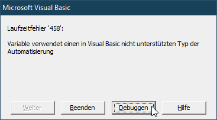

# COM_VVariant  
## The incredible VVariant class  

[](https://github.com/OlimilO1402/COM_VVariant/blob/master/LICENSE)
[](https://github.com/OlimilO1402/COM_VVariant/releases/latest)
[](https://github.com/OlimilO1402/COM_VVariant/releases/download/v1.0.0/COM_VVariant_v1.0.0.zip)
[](https://github.com/OlimilO1402/COM_VVariant/watchers)
  
Project started in aug. 2022.  
Have you ever encountered the runtime-error 458: "Variable uses a datatype of automation not supported in Visual Basic"? 
Have you ever discovered  the VT_-constants resp the VARENUM-enumeration, compared to the VbVarType-enum, there are so many more types. 
The VVariant class is the answer and gives a solution to these problems.  
Why the name VVariant:  
If I want to name a class but there already is a VB-keyword, I simply repeat the first letter, so it'll pop up at the same place in the alphabet. 
Moreover the two V are standing for Virtual-Value-Variable-Variant. 
But not enough, there is also a twin-brother to the VVariant class the class VVariantPtr which is a pointer to a variant. 
The class VVariantPtr is indeed a so called "weak-pointer" to a variant, so please know what you do and handle it with care.  

* [VARENUM](https://docs.microsoft.com/en-us/windows/win32/api/wtypes/ne-wtypes-varenum)  
* [VARIANT](https://docs.microsoft.com/en-us/windows/win32/api/oaidl/ns-oaidl-variant)  
* [PROPVARIANT](https://docs.microsoft.com/en-us/windows/win32/api/propidl/ns-propidl-propvariant)  
* [VARIANTARG](https://devblogs.microsoft.com/oldnewthing/20171221-00/?p=97625)  

```vba
Public Sub Test()
    Dim v1 As VVariant: set v1 = MNew.VVariant(123)
    MsgBox v1.VarTypeToStr
End Sub
```


